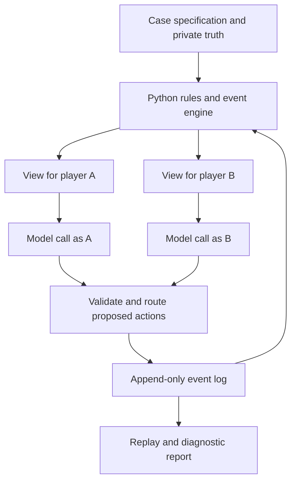

# A concrete sketch of the dojo

Proposal, September 26, 2026. No engine or game implemented. See [feasibility decision](FEASIBILITY.md) and [evidence/access record](FEASIBILITY_SOURCES.md). Source labels F01–F10 below resolve there. Engineering recommendations are design judgments unless attributed.

## One program, separate player views

The engine sees the answer; player prompts do not, except for facts their role legitimately knows. The report can inspect everything after a run. It cannot coach players during a measured run. Models get no repository/search tools that could expose the answer. One shared model can serve different players through independent requests; different identities do not require different neural networks or operating-system threads.

OpenAI supports explicitly supplied message history as well as managed conversation state (F01). I recommend application-owned per-player histories initially: they make the exact visible information auditable, portable across hosted/local models and easy to fork for comparisons. Separate provider conversation IDs are an alternative, not an isolation substitute. Never reuse an omniscient author/evaluator history as a player's history. Growing history also costs input tokens; managed state is not free memory.

“An agent” here means a role/personality policy, a private observation record, optional derived memory and repeated calls to a model. It is not another copy of the entire Codex research conversation. Having this assistant write both sides of a conversation while knowing the solution would be illustrative roleplay, not an isolated-agent test.

## A single exchange, precisely

Illustrative routing example only, not a mystery design:

1. A's brief says A saw a broken watch; B's says B has a timetable. Neither receives the other's private brief. C is elsewhere.
2. The scheduler puts A and B together. A's request contains A's brief, A's previous observations, the current scene and legal actions. It does not contain B's hidden notes or the solution.
3. A proposes a message to B and optionally requests to show a specific clue card. The program verifies recipients, scene restrictions and card possession. Structured output can keep the response parseable, but does not guarantee correctness (F02).
4. The spoken text is added to A's and B's observation logs, not C's. A private intention, if explicitly returned as a compact state field, stays private; it is not forwarded as dialogue. We do not need access to hidden model reasoning.
5. B's next request includes what A actually said, B's own observations and B's brief. B can doubt A, misunderstand, ask a question or lie. A's assertion is recorded as testimony, not automatically made true.
6. If B later speaks to C, only B's actual disclosure goes to C. At scene boundaries each player may report a suspect and supporting observed event IDs. This measures the agent's stated belief, not a human emotion or a privileged fact.

A group conversation delivers to everyone present; a public announcement goes to all. Overhearing must be a declared rule, not an evaluator's convenience. Inference is allowed: an agent can correctly guess an unseen fact. Distinguish inference from information accidentally supplied in its prompt by recording evidence provenance and using unfamiliar hidden test markers, not by declaring every correct guess a leak.

Keep **world truth, observed claims, inferred beliefs and current attention** separate. A complete personal transcript simulates perfect access to past observations. Limited retrieval or forgetting is a different attention model. Compare both; do not silently mistake a memory summary dropping a clue for a game defect. Likewise distinguish an agent's intentional fictional lie from an accidental invented artifact. Only the engine can create or transfer canonical evidence; unsupported dialogue remains a claim and is reviewable as possible model error.

## Character versus person playing the character

Each role needs fictional knowledge, relationships, goals and permitted deception. Separately, its simulated participant has behavior settings: initiative, willingness to reveal, task focus, memory access, willingness to improvise and tolerance for reading. A reserved guest playing an ambitious character is different from an ambitious model playing that character with perfect attention.

Start with explicit behavioral stress policies, such as “never volunteer the private card unless asked” or “leave after scene two.” These are reproducible adversarial conditions, not empirical personality distributions. “Introvert” as a prompt alone is not a calibrated model of shy guests. Avoid demographic stereotypes. Later observations of real play should inform settings and policy mixtures; sample diversity is not achieved merely by changing names or random seeds.

The first scheduler can use seeded pair rotations and bounded utterance counts. That deliberately simplifies who chooses whom. It cannot measure natural social exclusion under a system that forces everyone to meet. A later scheduler can let players seek/decline partners and form groups, with explicit time/capacity constraints. Disjoint conversations may run concurrently; causally linked replies must follow delivered events. A player cannot participate in two simultaneous private conversations. Stable event order, scene barriers and reservation rules prevent the engine from inventing impossible information flow.

Three simulated scenes are not a validated three-hour party. Food, interruptions, silence, reading and gestures are absent from a text trace unless explicitly modeled. A faster run does not imply a faster human evening.

## What the output should look like

A useful report would show: “Under withholding policy W, evidence E never reached any accuser before the deadline; the public fallback at scene 2 removed that bottleneck.” It would link to the exact trace, case version, model settings, prompts, accepted/rejected actions and repeat runs. A graph and timeline can expose who received which information, with a per-player replay for inspection.

Track clue reachability/delivery, unsupported claims, contradictory instructions, goal feasibility, role inactivity, interventions and supported accusations. Some semantic judgments need manual adjudication. “A simulated player said it had fun” is not a satisfaction metric. Do not collapse these into a single optimal-game score.

Use ordinary Python, JSON case files and append-only JSONL event logs initially; SQLite if indexing becomes useful. Add a small replay view only after traces are useful. No 3D world, speech synthesis, model training, autonomous rewriting or generalized agent framework is necessary. Save model responses for deterministic replay; seeds alone do not guarantee identical fresh model outputs. Retrying a request must not apply its action twice.

## Build, reuse, or use simpler tools?

| Approach | Good for | Main weakness / verdict |
|---|---|---|
| One omniscient chat improvises everyone | Cheap brainstorming and illustrative scenes | Contaminated viewpoints; cannot establish hidden-information behavior |
| Static clue/objective graph | Missing dependencies, redundant routes, cancellation checks | No conversational choices; essential baseline |
| Rule-based agents | Many cheap, interpretable disclosure/attendance sweeps | Behavior rules are ours; cannot discover linguistic ambiguity |
| Small Python engine with separate model calls | Inspectable dialogue, deception and local beliefs | Needs isolation tests and human relevance checks; preferred research option |
| Existing social-agent framework | Reuse schemas, runners and evaluation concepts | Game truth/visibility still custom; inspect before adopting dependencies |
| Local versus hosted inference | Local avoids per-token API charges; hosted offers another quality comparison | Local tiny-call connectivity verified; realistic quality/throughput and hosted access unverified |

SOTOPIA already provides an open-source social-agent environment (F07), with local JSON and Redis storage options. It is a serious reuse candidate, not evidence that our domain has a ready-made solution. This pass inspected its README, not its internals or integration effort. Generative Agents demonstrated memory/planning-driven interactions among 25 agents (F04); that supports architectural plausibility, not accurate forecasts of dinner guests. SOTOPIA's human comparisons and SOTOPIA-π's evaluator-overestimation result reinforce the need for external validation (F05/F06). These papers are precedents, not current-model benchmarks or a literature census.

## Cost and runtime: order of magnitude, not a quote

Illustrative full run: 3 scenes × 4 pairs × 6 pair rotations × 4 utterances = 288 speaking calls, plus 8 player summaries × 3 scenes = **312 calls**. This is a proposed turn budget, not a calibrated party. At an assumed average 8,000 input and 500 billable output tokens/call, including reasoning where billed, it consumes 2.496M input and 0.156M output tokens. Longer histories, reasoning, adjudication, retries and designer evaluation increase this.

Using the Standard short-context uncached rates retrieved September 26 (F03):

| Example model tier | Input / output per million | One illustrative run | 100 runs |
|---|---|---:|---:|
| GPT-6 Luna | $0.10 / $0.50 | $0.33 | $32.76 |
| GPT-6 Sol | $2 / $10 | $6.55 | $655.20 |
| GPT-6 Astra | $10 / $50 | $32.76 | $3,276.00 |

These are price examples, not quality recommendations or confirmed account availability. They exclude cache effects, regional uplifts, taxes and development/content work. Cache writes can cost more than uncached input; hits cost less (F08). If all input were charged at the listed 1.25× write rate with no reuse, the respective run costs become $0.39 / $7.80 / $39.00. A 2,000-output-token average instead of 500 makes the uncached Sol scenario $11.23/run. Count all billable output, not just spoken dialogue. Actual usage must replace these assumptions before a sweep.

At assumed 1/5/15 seconds per call, a serial 312-call run takes 5.2/26/78 minutes before overhead. Four disjoint conversations may reduce latency, but not reply dependencies or total token cost. These are arithmetic scenarios, not speed benchmarks. Local runs still consume hardware time and power. The local three-call smoke test measured 13.036 seconds cold (mostly loading), then 0.140 and 0.385 seconds warm for 2–9 generated tokens and 47–62 prompt tokens. Those tiny requests cannot establish latency for 8,000-token player contexts or long replies.

First measure a few calls, then a short interaction; impose a request/token/spend cap before larger runs. A Pro upgrade does not by itself verify this program's API credentials, billing or model access (F09).

## Effort estimate and experimental gates

Low-confidence engineering estimates for my work with review, assuming a working endpoint and modest text-only scope. Not a promised wall-clock schedule; access, model failures and owner decisions can extend it.

| Work | Estimated focused effort | Exit evidence |
|---|---:|---|
| Small isolated interaction probe | 4–8 hours | Two to four roles, exact prompt logging, routing/visibility and retry tests, one live exchange |
| Extend to eight roles/three scenes | Additional 6–12 hours | Case schema, staged releases, checkpoints, bounded scheduling and validated actions |
| Useful comparison/reporting harness | Additional 6–16 hours | Static/rule-based controls, small repeated trials, error classification and readable traces |
| Human calibration / finished game / public video | Not included | Requires real people, original content, revisions and separate production estimates |

Thus roughly **16–36 focused hours** for an inspectable research harness, not a trustworthy human simulator. One technical demo could be quicker, but does not answer the business question. No calibrated forecast of a commercial completion date is defensible yet.

The first comparison should include a clean case, planted missing-information and conflicting-incentive failures, and withheld variants not described to player prompts. Compare static checks, simple rule policies, and dialogue agents using the same case versions. Freeze the evaluation criteria before runs; count missed failures and false alarms, not merely memorable transcripts. Keep failed runs and model errors rather than silently repairing them. Independent human review of ambiguous findings is necessary.

Advance only if dialogue contributes actionable findings beyond the cheaper baseline and they survive changes of policy/model and manual inspection. If it mostly rediscovers graph errors, keep the cheaper tool. If behavior collapses, repair the simulation before revising the game. If findings depend on implausible agents, narrow claims or stop. Before asserting human benefit, predeclare concrete predictions and compare them with real sessions; retain unpredicted failures too. Early sessions diagnose, not establish market-wide effect sizes.

A toy planted bug checks plumbing; it is not the decisive milestone. The decisive milestone is **incremental, credible design insight**. Only the user-requested three-call local connectivity/context probe was executed. No game simulation, recruitment, paid run or game construction occurred in this feasibility pass.
